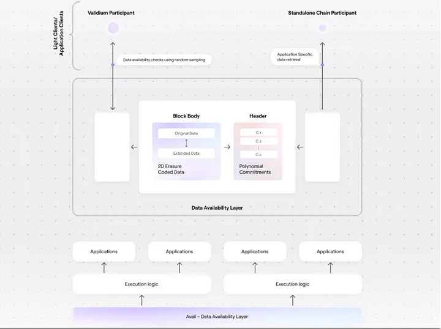
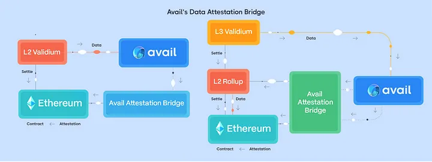
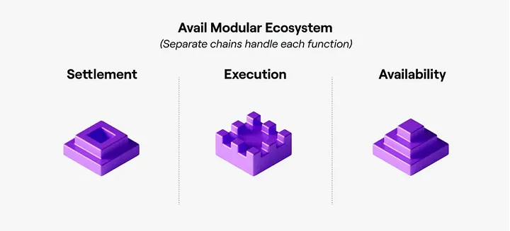

## Challenge 2: Avail Architecture

### What is the structure of the blockchain?
Avail, as a Layer 2 (L2) blockchain on Ethereum, has a unique architecture designed to complement the Ethereum network's capabilities. While it operates as a separate chain, it leverages the security and consensus of Ethereum for certain aspects.

### Block Structure:
**Data Blocks:** Avail's core function is to make data available. Each block on Avail primarily contains transaction data and data availability proofs. These proofs ensure that the data within the block is available for verification by the Ethereum network.

### Block Ordering:
Blocks are connected sequentially, with each block referencing the previous block's hash to maintain a chain-like structure. This ensures the immutability of the data stored on Avail.

### Lowest Unit of State Change:
The lowest unit that records a state change in Avail is a transaction. Transactions contain information about the sender, recipient, amount of tokens transferred, and any additional data relevant to the transaction.

### Consensus Mechanism and Rewards in Avail:
Avail utilizes Ethereum's consensus mechanism for security. This means that Avail's security is ultimately backed by the same decentralized network of validators that secure the Ethereum network.

### Reward Mechanism for Validators:
The specifics of Avail's reward mechanism are still under development. However, it's expected that validators will be incentivized to maintain the network by earning rewards for their participation in data availability sampling and block production.

### Known Attacks on Avail:
**Data Withholding Attacks:** A potential attack vector on Avail is data withholding, where a node intentionally refuses to share data. However, Avail's data availability sampling protocol is designed to mitigate this risk by requiring nodes to prove the availability of data through random sampling.

**51% Attack:** As Avail relies on Ethereum's security, it is not directly susceptible to 51% attacks. However, a successful 51% attack on Ethereum could theoretically compromise Avail's security as well.

### Chain Reorgs and Block Times
Avail's design aims to minimize the possibility of chain reorganizations (reorgs). However, as it operates on Ethereum, it might be indirectly affected by reorgs on the Ethereum network. The average block interval and confirmation time on Avail are still being optimized and will depend on the specific implementation details of the network.

### Avail VM Design and Architecture
Avail does not have its own virtual machine (VM). Instead, it is compatible with the Ethereum Virtual Machine (EVM), meaning that Ethereum smart contracts can be deployed and executed on Avail without significant modifications.

### Gas or Transaction Fee on Avail
Avail utilizes a concept similar to gas fees on Ethereum to compensate validators for their work in providing data availability. The exact calculation of gas fees and the native token used for payment are still being determined as Avail is in active development.

### Token Standards on Avail
Since Avail is EVM-compatible, it supports the same token standards as Ethereum, including ERC-20 (fungible tokens), ERC-721 (non-fungible tokens), and ERC-1155 (semi-fungible tokens). These tokens can be seamlessly transferred between Ethereum and Avail.

### Popular Tokens on Avail
As Avail is in its testnet phase, the ecosystem of tokens is still evolving. However, it's expected that popular Ethereum tokens like USDC, USDT, and WETH will be widely used on Avail once it launches on mainnet.

### Replay Attacks and Nonce
Avail likely implements mechanisms to prevent replay attacks, such as sequence numbers or nonces, similar to Ethereum. This ensures that each transaction is unique and cannot be replayed to manipulate the network. The specific implementation details may vary, so it's important to refer to Avail's official documentation for the most accurate information.

### Transaction Lifecycle
1. **Transaction Submission:** A user submits a transaction to an Avail node.
2. **Data Availability Sampling:** The node verifies the availability of the transaction data using the DAS protocol.
3. **Block Inclusion:** The transaction is included in a block on the Avail chain.
4. **Ethereum Verification:** The data availability proofs for the block are submitted to Ethereum for verification.
5. **Transaction Finality:** Once the data availability proofs are verified on Ethereum, the transaction is considered final on Avail.

